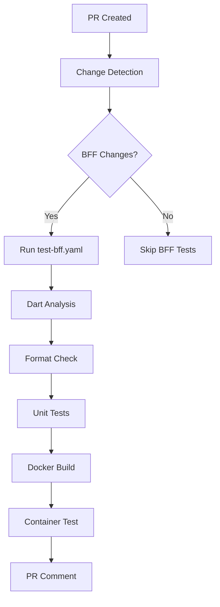
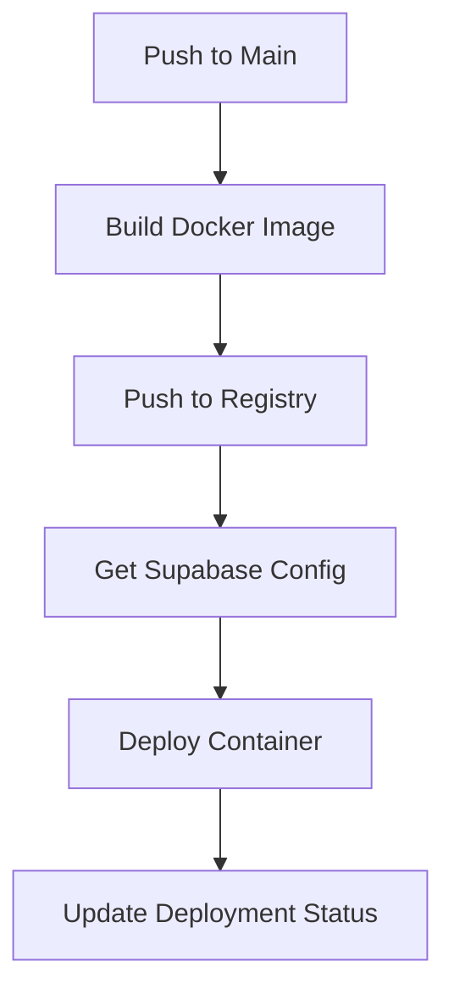

# CI Fixes Summary - BFF Engine Migration

## 🎯 Overview

This document summarizes the comprehensive CI/CD fixes implemented after migrating the BFF engine from WebAssembly/Cloudflare Workers to dart_frog/Docker.

## ✅ Fixed CI Workflows

### 1. Updated `deploy-bff.yaml` 
**Status**: ✅ Complete

**Old Architecture**:
- Built with `dart compile wasm`
- Deployed to Cloudflare Workers using `wrangler`
- Used WebAssembly artifacts

**New Architecture**:
- Builds Docker images using multi-stage builds
- Pushes to GitHub Container Registry (ghcr.io)
- Deploys containerized applications
- Uses mise for tool management

**Key Changes**:
- ✅ Replaced `build-dart-engine` job with `build-and-push-docker`
- ✅ Removed WebAssembly compilation (`dart compile wasm`)
- ✅ Added Docker Buildx setup and container registry login
- ✅ Added Docker image tagging and metadata extraction
- ✅ Replaced Cloudflare Workers deployment with container deployment
- ✅ Updated environment variable handling for containerized deployment
- ✅ Added Docker layer caching for faster builds

### 2. Created `test-bff.yaml`
**Status**: ✅ Complete

**Purpose**: 
New workflow for comprehensive testing during pull requests and main branch pushes

**Features**:
- ✅ Dart code analysis (`dart analyze`)
- ✅ Code formatting checks (`dart format`)
- ✅ Unit test execution (`dart test`)
- ✅ Docker build verification
- ✅ Container health checks
- ✅ Automated PR comments for test results

**Test Coverage**:
- `packages/bff_client/` - Client package tests
- `packages/db_types/` - Database types tests  
- `bff/engine/` - Main engine tests

### 3. Updated `check-pr.yaml`
**Status**: ✅ Complete

**Changes**:
- ✅ Added `test-bff` workflow to PR checks
- ✅ Integrated with existing change detection
- ✅ Added to status check dependencies

## 🧪 Test Infrastructure

### Created Test Files
1. **`bff/engine/test/routes_test.dart`**
   - Tests for index and health endpoints
   - Response validation
   - JSON content verification

2. **`bff/engine/test/util/result_test.dart`**
   - Comprehensive Result utility tests
   - Success/Failure pattern validation
   - Exception handling verification

3. **`bff/engine/test/provider/supabase_util_test.dart`**
   - SupabaseUtil functionality tests
   - Authorization exception handling
   - Mock-based testing with mocktail

### Updated Dependencies
- ✅ Added `mocktail: ^1.0.4` for mocking in tests
- ✅ Added `test: ^1.24.3` for test framework
- ✅ Maintained dart_frog dependencies

## 🐳 Docker CI Integration

### Build Strategy
- **Multi-stage builds**: Separate builder and runtime images
- **Layer caching**: GitHub Actions cache for faster builds
- **Security**: Non-root user execution
- **Health checks**: Built-in container health monitoring

### Registry Configuration
- **Registry**: GitHub Container Registry (ghcr.io)
- **Authentication**: GitHub token-based
- **Tagging Strategy**:
  - Branch-based tags
  - PR-based tags
  - Environment-specific tags (`staging`, `production`)
  - SHA-based tags for traceability

### Deployment Simulation
- Container startup testing
- Health endpoint verification
- Basic functionality testing
- Proper cleanup procedures

## 🔧 Environment Configuration

### Updated Environment Variables
**Old (Cloudflare Workers)**:
- Used CF Workers environment bindings
- Runtime secret injection via wrangler

**New (Docker/Dart VM)**:
- `SUPABASE_URL` - Project URL from Terraform
- `SUPABASE_SERVICE_ROLE_KEY` - Service key from secrets
- `PORT` - Server port (default: 8080)
- `HOST` - Server host (default: 0.0.0.0)

### Secrets Management
- ✅ Maintained SOPS integration for sensitive data
- ✅ Updated secret extraction for containerized environment
- ✅ Environment-specific configuration (staging/production)

## 📊 CI Pipeline Flow

### Pull Request Flow

### Main Branch Flow

## 🚀 Deployment Strategy

### Staging Environment
- **URL**: `https://staging-bff.flutterkaigi.jp`
- **Trigger**: Pull requests affecting BFF code
- **Purpose**: Testing and validation

### Production Environment  
- **URL**: `https://2025-bff.flutterkaigi.jp`
- **Trigger**: Pushes to main branch
- **Purpose**: Live production deployment

## 📋 Verification Checklist

- ✅ WebAssembly compilation removed
- ✅ Cloudflare Workers deployment removed
- ✅ Docker build and push implemented
- ✅ Container registry authentication configured
- ✅ Test infrastructure created
- ✅ PR integration tests working
- ✅ Environment variable handling updated
- ✅ Health check endpoints verified
- ✅ Documentation updated

## 🔄 Migration Benefits

### Performance
- **Faster builds**: Docker layer caching
- **Parallel execution**: Separate test and build jobs
- **Efficient testing**: Only runs on relevant changes

### Reliability
- **Container isolation**: Consistent runtime environment
- **Health monitoring**: Built-in health checks
- **Comprehensive testing**: Unit tests + integration tests

### Developer Experience
- **Local development**: Docker Compose support
- **Clear feedback**: Automated PR comments
- **Easy debugging**: Container logs and health checks

### Deployment Flexibility
- **Platform agnostic**: Can deploy anywhere Docker runs
- **Scaling options**: Container orchestration ready
- **Environment parity**: Same container in all environments

## 🛠️ Next Steps

1. **Configure actual deployment target** (replace placeholder deployment)
2. **Set up production secrets** in repository settings
3. **Configure domain DNS** for staging and production URLs
4. **Monitor CI performance** and optimize build times
5. **Add integration tests** with real Supabase instance

## 📚 Related Documentation

- [Migration Summary](./MIGRATION_SUMMARY.md) - Original migration details
- [BFF Engine README](./bff/engine/README.md) - Updated application documentation
- [Docker Compose Guide](./bff/engine/compose.yaml) - Local development setup
