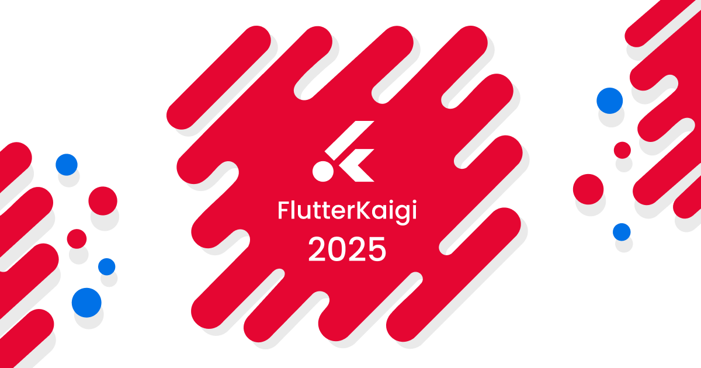
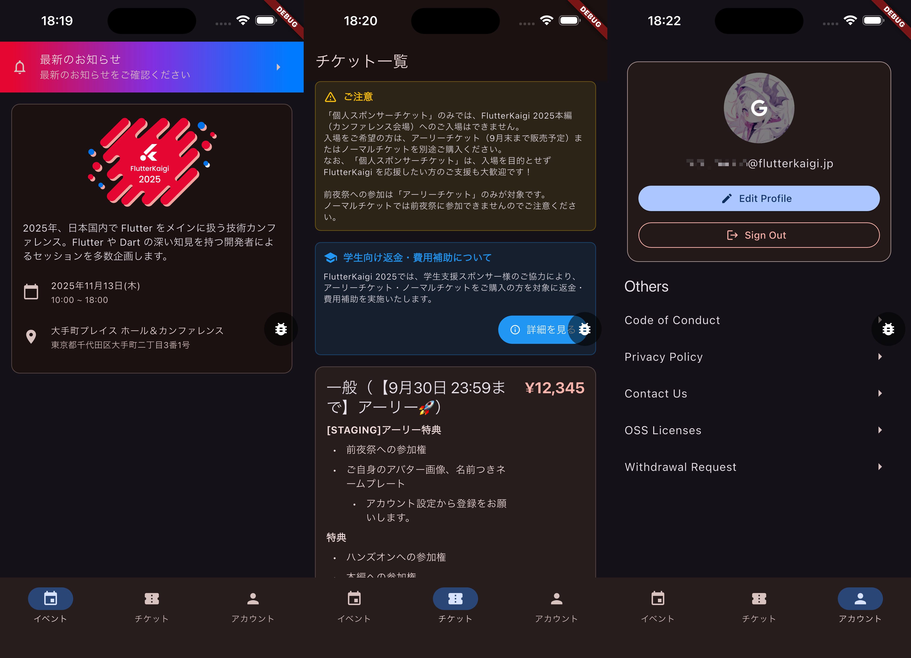

# FlutterKaigi 2025

**FlutterKaigi 2025** は今年で5回目の開催となります！ Flutter 開発者同士の知識共有とコミュニケーションを促進するカンファレンスで、2025年11月13日に開催されます。

このリポジトリには、FlutterKaigi 2025 のカンファレンスアプリ、ウェブサイト、BFF (Backend for Frontend) が含まれています。

## 機能

FlutterKaigi 2025 アプリは、カンファレンス参加者向けに以下の機能を提供します。

- **セッション情報の閲覧**: すべてのセッションの詳細情報を確認
- **スピーカー情報の確認**: 登壇者のプロフィールと経歴を閲覧
- **スケジュール管理**: タイムテーブルの確認と予定の管理
- **お気に入り登録**: 興味のあるセッションをマーク

## スクリーンショット



## アーキテクチャ

FlutterKaigi 2025 アプリは、公式の Flutter アーキテクチャガイダンスに従い、モノレポ構成で構築されています。

このアプリケーションは以下の設計原則に従っています。

- **モノレポ構成**: Pub workspaces / Melos を使用した複数パッケージの統合管理
- **コード生成**: build_runner、freezed、json_annotation による型安全性の確保
- **BFF パターン**: Dart Shelf フレームワークによる REST API サーバーと TypeScript プロキシの組み合わせ

### 概要

アプリは以下のレイヤーで構成されています。

#### アプリケーション層

```
flutterkaigi-2025/
└── apps/
    ├── app/                # メインのカンファレンスアプリ (iOS/Android/Web)
    ├── app_catalog/        # カンファレンスアプリのカタログ (Widgetbook)
    └── website/            # 静的ウェブサイト (Jaspr)
```

#### BFF レイヤー

```
└── bff/
    ├── engine/             # Dart 製 BFF エンジン (WebAssembly にコンパイル)
    └── bridge/             # TypeScript ブリッジ (Cloudflare Workers)
```

#### 共有パッケージ

```
└── packages/
    ├── auth_client/        # 認証クライアント (Supabase 連携)
    ├── bff_client/         # BFF API クライアント
    ├── db_client/          # データベースクライアント
    ├── db_types/           # データベース型定義
    └── flutterkaigi_lints/ # カスタム lint ルール
```

### モジュール化

共有パッケージは以下の責務に分割されています。

| パッケージ           | 責務                           |
| -------------------- | ------------------------------ |
| `auth_client`        | Supabase 認証の抽象化          |
| `bff_client`         | BFF API との通信               |
| `db_client`          | データベースアクセス           |
| `db_types`           | データベーススキーマの型定義   |
| `flutterkaigi_lints` | プロジェクト固有の lint ルール |

## 技術スタック

このプロジェクトは以下の技術を使用しています。

| カテゴリ           | 技術                                                                      |
| ------------------ | ------------------------------------------------------------------------- |
| UI フレームワーク  | [Flutter](https://flutter.dev/)                                           |
| プログラミング言語 | [Dart](https://dart.dev/) / [TypeScript](https://www.typescriptlang.org/) |
| バックエンド       | [Supabase](https://supabase.com/)                                         |
| 静的サイト生成     | [Jaspr](https://jaspr.site/)                                              |
| サーバーレス       | [Cloudflare Workers](https://workers.cloudflare.com/)                     |
| モノレポ管理       | [Melos](https://melos.invertase.dev/)                                     |
| バージョン管理     | [mise](https://mise.jdx.dev/)                                             |

## UI とデザイン

アプリの UI は [Material Design 3](https://m3.material.io/) のガイドラインに従って構築されています。

## コントリビューション

コントリビュートを始めるためのステップバイステップガイドは [CONTRIBUTING.md](CONTRIBUTING.md) を参照してください。

私たちはあなたの貢献をお待ちしています！初めての方でも安心して取り組めるよう、環境構築から PR 作成まで丁寧に解説しています。

## 環境構築

### 前提条件

このプロジェクトをビルド・実行するには、以下が必要です。

- [mise](https://mise.jdx.dev/) (推奨)
- Flutter SDK (推奨バージョンは [mise.toml](mise.toml) を参照)
- Dart SDK
- Bun runtime (BFF 開発用)

### セットアップ

リポジトリのクローン後、以下のコマンドを実行してプロジェクトの環境構築を実施します。

```bash
# プロジェクトの初期化
mise run bootstrap
```

`mise run bootstrap` は以下の処理を順次実行します。

- **mise install**: mise.toml で定義された各種開発ツールをインストール
  - Flutter SDK
  - Dart SDK
  - Bun runtime
  - Node.js
  - その他の開発ツール (dprint、terraform、aws-cli など)
- **bun install**: BFF プロジェクトの Node.js 依存関係をインストール
- **melos bootstrap**: モノレポ全体の Dart/Flutter 依存関係をインストール・リンク

### アプリケーションの実行

このモノレポには複数のアプリケーションが含まれています。各アプリの詳細な実行方法は、それぞれの README を参照してください。

#### カンファレンスアプリ

FlutterKaigi 2025 のメインアプリケーション (iOS/Android/Web 対応)

📖 **詳細**: [apps/app/README.md](apps/app/README.md)

#### Widgetbook カタログ

カンファレンスアプリのコンポーネントカタログ

📖 **詳細**: [apps/app_catalog/README.md](apps/app_catalog/README.md)

#### ウェブサイト

FlutterKaigi 2025 の公式ウェブサイト (Jaspr 製)

📖 **詳細**: [apps/website/README.md](apps/website/README.md)

#### BFF (Backend for Frontend)

Dart 製 REST API サーバー (Shelf) + TypeScript プロキシ (Cloudflare Workers)

📖 **詳細**: [bff/engine/README.md](bff/engine/README.md) / [bff/bridge/README.md](bff/bridge/README.md)

## 開発

### コード生成

このプロジェクトでは、freezed や json_serializable などのコード生成を活用しています。モデルやルーターを変更した場合は、以下のコマンドでコードを再生成してください。

```bash
# すべてのコード生成 (build_runner + l10n)
melos run gen

# build_runner のみ
melos run gen:build

# ウォッチモード (自動再生成)
melos run gen:build:watch

# 未コミット変更のみ
melos run gen:diff:head

# main ブランチとの差分
melos run gen:diff:main
```

### テスト

#### テストの実行

```bash
# すべてのテスト実行
melos run test

# 特定のアプリのテスト (例: apps/app)
melos exec --scope="app" -- flutter test
```

### コード品質

コード品質を維持するため、以下のツールとコマンドを使用しています。

```bash
# フォーマットチェック
melos run format:check

# フォーマット適用
melos run format

# 静的解析
cd apps/app && flutter analyze

# コード修正
melos run fix

# カスタム lint の修正
melos run fix:custom
```

## パフォーマンス

アプリのパフォーマンスを最適化するために、以下の手法を採用しています。

- **コード生成による型安全性**: ランタイムエラーを最小化
- **効率的なデータ取得**: Supabase による最適化されたクエリ
- **遅延ローディング**: 必要な時に必要なデータのみ取得

## ライセンス

FlutterKaigi 2025 は Apache License (Version 2.0) の条件の下で配布されています。詳細については [LICENSE](LICENSE) を参照してください。
