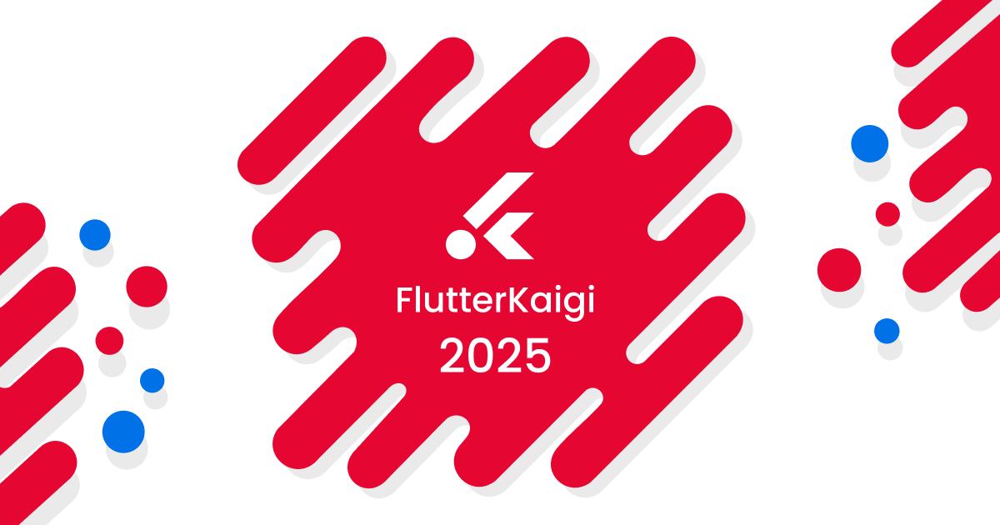
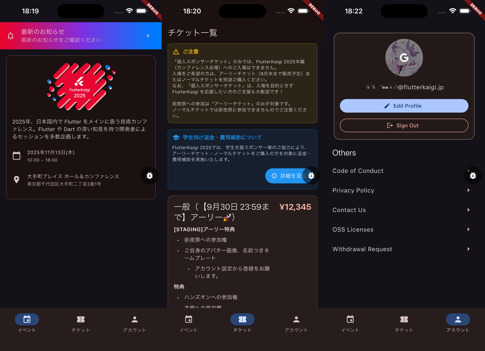

# FlutterKaigi 2025

**FlutterKaigi 2025**は今年で5回目の開催となります！Flutter開発者同士の知識共有とコミュニケーションを促進するカンファレンスで、2025年11月13日に開催されます。

## 機能

- セッション情報の閲覧
- スピーカー情報の確認
- スケジュール管理
- お気に入り登録
- オフライン対応

## スクリーンショット



## 技術スタック

このプロジェクトは以下の技術を使用しています:

- **[Flutter](https://flutter.dev/)** - クロスプラットフォームUIフレームワーク
- **[Dart](https://dart.dev/)** - プログラミング言語
- **[Supabase](https://supabase.com/)** - バックエンドサービス（認証・データベース）
- **[Jaspr](https://jasprpad.dev/)** - Dartベースの静的サイト生成
- **[Cloudflare Workers](https://workers.cloudflare.com/)** - BFFホスティング
- **[Melos](https://melos.invertase.dev/)** - モノレポ管理ツール
- **[mise](https://mise.jdx.dev/)** - 開発環境のバージョン管理

## アーキテクチャ

このアプリケーションは以下の設計原則に従っています:

- **モノレポ構成**: Pub workspaces / Melos を使用した複数パッケージの統合管理
- **完全モジュール化**: 機能ごとに独立したパッケージ構成
- **コード生成**: build_runner、freezed、json_annotationによる型安全性の確保
- **BFFパターン**: Dart製WebAssemblyエンジンとTypeScriptブリッジの組み合わせ

### プロジェクト構造

```
flutterkaigi-2025/
├── apps/
│   ├── app/              # メインのカンファレンスアプリ
│   ├── app_catalog/      # カンファレンスアプリのカタログ
│   └── website/          # 静的ウェブサイト
├── bff/
│   ├── engine/           # Dart製BFFエンジン（WebAssembly）
│   └── bridge/           # TypeScriptブリッジ
└── packages/
    ├── auth_client/      # 認証クライアント
    ├── bff_client/       # BFF APIクライアント
    ├── db_client/        # データベースクライアント
    ├── db_types/         # データベース型定義
    └── flutterkaigi_lints/ # カスタムlintルール
```

### アプリケーション

#### カンファレンスアプリ (`apps/app/`)

FlutterKaigi 2025のメインアプリケーションです。iOS/Androidで動作します。

**主な機能:**
- セッション一覧・詳細表示
- スケジュール管理
- お気に入り機能
- オフライン対応

#### ウェブサイト (`apps/website/`)

Jasprで構築された静的ウェブサイトです。

#### Widgetbookカタログ (`apps/app_catalog/`)

UIコンポーネントのカタログです。デザインシステムの確認や開発に使用します。

### BFF (Backend for Frontend)

- **エンジン** (`bff/engine/`): Dartで実装され、WebAssemblyにコンパイルされるBFFロジック
- **ブリッジ** (`bff/bridge/`): WebAssemblyエンジンを呼び出すTypeScript実装
- **デプロイ先**: Cloudflare Workers

### モジュール化

共有パッケージは以下の責務に分割されています:

- `auth_client`: Supabase認証の抽象化
- `bff_client`: BFF APIとの通信
- `db_client`: データベースアクセス
- `db_types`: データベーススキーマの型定義
- `flutterkaigi_lints`: プロジェクト固有のlintルール

## ビルド

### 必要な環境

- Flutter SDK
- Dart SDK
- Bun runtime (BFF開発用)
- mise (推奨)

### セットアップ

1. **miseを使用した環境構築** (推奨)

```bash
# プロジェクトの初期化
mise run bootstrap

# 依存関係のインストール
melos bootstrap
```

2. **Flutterの設定**

```bash
# Swift Package Managerを有効化（初回のみ）
flutter config --enable-swift-package-manager
```

### アプリケーションの実行

#### カンファレンスアプリ

```bash
cd apps/app
flutter pub get
flutter run -d {device}
```

#### ウェブサイト

```bash
cd apps/website
make dev
```

#### Widgetbookカタログ

```bash
cd apps/app_catalog
flutter run -d {device}
```

#### BFF開発サーバー

```bash
cd bff/bridge
bun install
bun run dev
```

### コード生成

モデルやルーターを変更した場合、コード生成が必要です:

```bash
# すべてのコード生成（build_runner + l10n）
melos run gen

# build_runnerのみ
melos run gen:build

# ウォッチモード（自動再生成）
melos run gen:build:watch

# 未コミット変更のみ
melos run gen:diff:head

# mainブランチとの差分
melos run gen:diff:main
```

## テスト

### テストの実行

```bash
# すべてのテスト実行
melos run test

# 特定のアプリのテスト
cd apps/app && flutter test
```

### コード品質チェック

```bash
# フォーマットチェック
melos run format:check

# フォーマット適用
melos run format

# 静的解析
cd apps/app && flutter analyze

# コード修正
melos run fix

# カスタムlintの修正
melos run fix:custom
```

## 開発ワークフロー

### ブランチ戦略

- **メインブランチ**: `main`
- **機能追加**: `feat/GH-{issue番号}/description`
- **バグ修正**: `fix/GH-{issue番号}/description`
- **その他**: `docs/`, `chore/`, `ci/`, `refactor/`, `style/`, `test/`, `build/`, `perf/`

ブランチは短命に保ち、1週間以内のマージを目標とします。

### コミット前チェックリスト

- [ ] `melos run format:check` でフォーマットを確認
- [ ] `melos run test` でテストが通ることを確認
- [ ] モデル/ルーター変更時は `melos run gen` を実行
- [ ] コミットメッセージは[Conventional Commits](https://www.conventionalcommits.org/)形式

### ワークスペース管理

```bash
# ワークスペースのクリーンアップ
mise run clean

# 依存関係の再インストール
melos clean && melos bootstrap
```

## UI とデザイン

- **デザインシステム**: Material Design 3
- **テーマ**: ライトモード・ダークモード対応
- **レスポンシブ**: タブレットレイアウト対応

## パフォーマンス

- コード生成による型安全性の確保
- Supabaseによる効率的なデータ取得
- オフライン対応

## ライセンス

このプロジェクトのライセンスについては、[LICENSE](LICENSE)ファイルを参照してください。

---

**Learn more:**
- [FlutterKaigi 公式サイト](https://flutterkaigi.jp/)
- [Flutter Documentation](https://docs.flutter.dev/)
- [Dart Documentation](https://dart.dev/guides)
