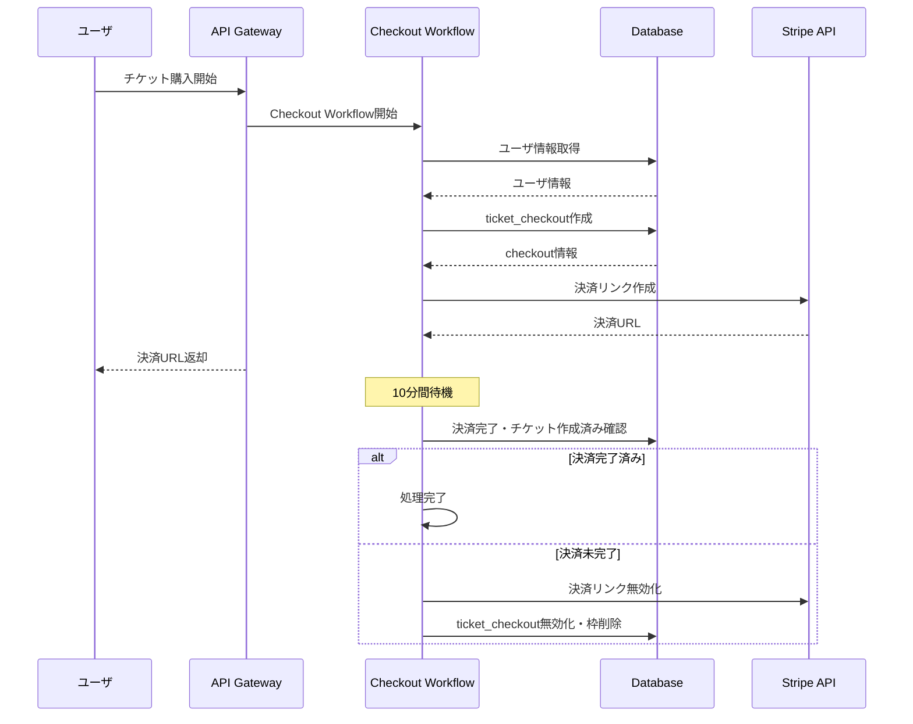
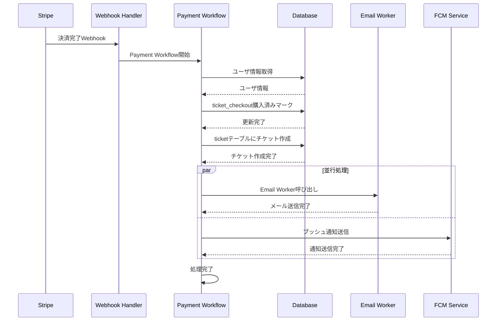

# Payment Workflow 仕様書

## 概要

Payment Workflowでは、チケット購入プロセスを安全かつ確実に処理するための2つのワークフローを実装します。

## ワークフロー概要

### 1. Ticket Checkout Workflow（チケット確保・タイムアウト処理）

チケット購入開始時に実行され、10分間の確保期間を管理します。

### 2. Payment Completion Workflow（決済完了処理）

Stripeからの決済完了Webhookを受信した際に実行され、チケット作成と通知を行います。

## ワークフロー詳細

### 1. Ticket Checkout Workflow

### 2. Payment Completion Workflow

## データベース構造

### ticket_checkout テーブル

- チケット確保情報を管理
- 状態：pending（確保中）、completed（購入完了）、expired（期限切れ）

### ticket テーブル

- 購入完了したチケット情報を管理
- ユーザーと紐づけられたチケット詳細

## 外部サービス連携

### Stripe API

- 決済リンクの作成・無効化
- Webhook経由での決済完了通知受信

### Email Worker

- Service Bindingによる連携
- チケット購入完了メールの送信

### FCM (Firebase Cloud Messaging)

- プッシュ通知の送信
- ユーザーへのリアルタイム通知

## エラーハンドリング

### タイムアウト処理

- 10分経過後に自動的にチケット確保を解除
- Stripe決済リンクを無効化してセキュリティを確保

### 重複購入防止

- ticket_checkoutテーブルでの状態管理
- 同一ユーザーの重複購入をブロック

### 決済失敗時の対応

- Stripe Webhookでの失敗通知処理
- 適切なロールバック処理
