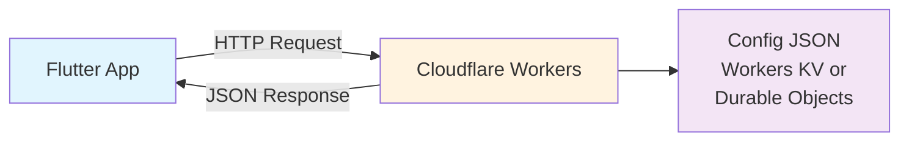

# FlutterKaigi 2025 アプリ強制アップデート機能

## 概要

FlutterKaigi 2025アプリにおける強制アップデート機能の設計とアーキテクチャについて記載します。

強制アップデート機能は、重要なバグ修正や必須機能の追加時に、古いバージョンのアプリ利用者に対してアップデートを促す仕組みです。本機能はCloudflare Workersを活用し、軽量かつ高速に動作するよう設計されています。

## アーキテクチャ

### システム構成



### コンポーネント

1. **Flutter アプリ (Client)**
   - アプリ起動時またはフォアグラウンド復帰時にバージョンチェックを実行
   - 現在のアプリバージョンとプラットフォーム情報を送信
   - レスポンスに基づいてアップデートダイアログを表示

2. **Cloudflare Workers (API)**
   - `/v1/app/version` エンドポイントを提供
   - バージョン情報のチェックと判定ロジックを実装
   - 高速レスポンスと高可用性を実現

3. **設定管理 (Storage)**
   - Workers KVまたはDurable Objectsでバージョン設定を管理
   - 管理画面経由での設定更新が可能

## API仕様

### エンドポイント

`GET /v1/app/version`

### リクエストパラメータ

リクエストパラメータは不要で、シンプルなGETリクエストでアクセス可能です。

### レスポンス

```json
{
  "result": {
    "minimum_version": "1.0.0",
    "latest_version": "1.2.3",
    "store_urls": {
      "ios": "https://apps.apple.com/jp/app/flutterkaigi/id...",
      "android": "https://play.google.com/store/apps/details?id=jp.flutterkaigi"
    },
    "message": {
      "ja": "新しいバージョンが利用可能です",
      "en": "A new version is available"
    }
  }
}
```

#### レスポンスフィールド

| フィールド      | 型     | 説明                                      |
| --------------- | ------ | ----------------------------------------- |
| minimum_version | string | サポートされる最小バージョン              |
| latest_version  | string | 最新のアプリバージョン                    |
| store_urls      | object | iOS・Android両プラットフォームのストアURL |
| message         | object | 多言語対応のメッセージ                    |

## 実装詳細

### BFF側の実装 (Cloudflare Workers)

#### 1. 新規APIサービスの作成

`bff/engine/lib/routes/app_version_api_service.dart`:

```dart
import 'package:shelf/shelf.dart';
import 'package:shelf_router/shelf_router.dart';
import 'package:engine/util/json_response.dart';

part 'app_version_api_service.g.dart';

class AppVersionApiService {
  @Route.get('/version')
  Future<Response> checkVersion(Request request) async {
    // バージョン設定を取得（Workers KVまたは環境変数から）
    final config = await _getVersionConfig();
    
    return jsonResponse(
      () async => {
        'result': {
          'minimum_version': config['minimum_version'],
          'latest_version': config['latest_version'],
          'store_urls': {
            'ios': config['ios_store_url'],
            'android': config['android_store_url'],
          },
          'message': config['message'],
        }
      },
    );
  }
  
  Future<Map<String, dynamic>> _getVersionConfig() async {
    // 環境変数または Workers KVから設定を読み込み
    return {
      'minimum_version': '1.0.0',
      'latest_version': '1.2.3',
      'ios_store_url': 'https://apps.apple.com/jp/app/flutterkaigi/id...',
      'android_store_url': 'https://play.google.com/store/apps/details?id=jp.flutterkaigi',
      'message': {
        'ja': '新しいバージョンが利用可能です',
        'en': 'A new version is available',
      },
    };
  }
  
  Handler get router => _$AppVersionApiServiceRouter(this).call;
}
```

#### 2. APIサービスの登録

`bff/engine/lib/routes/api_service.dart`に追加:

```dart
@Route.mount('/v1/app')
Router get _appVersionApiService => AppVersionApiService().router;
```

### Flutter側の実装

#### 1. バージョンチェッククライアント

`packages/bff_client/lib/src/app_version_client.dart`:

```dart
class AppVersionClient {
  final BffClient _client;
  
  AppVersionClient(this._client);
  
  Future<AppVersionResponse> checkVersion() async {
    final response = await _client.get('/v1/app/version');
    return AppVersionResponse.fromJson(response.data);
  }
}
```

#### 2. アプリ側の実装

`apps/app/lib/features/force_update/`:

```dart
class ForceUpdateChecker {
  final AppVersionClient _client;
  
  ForceUpdateChecker(this._client);
  
  Future<void> checkAndShowUpdateDialog(BuildContext context) async {
    final packageInfo = await PackageInfo.fromPlatform();
    final platform = Platform.isIOS ? 'ios' : 'android';
    
    try {
      final response = await _client.checkVersion();
      
      // アプリ側でセマンティックバージョン比較を実行
      final currentVersion = packageInfo.version;
      final minimumVersion = response.minimumVersion;
      
      if (_isUpdateRequired(currentVersion, minimumVersion)) {
        await _showForceUpdateDialog(context, response, platform);
      } else if (_isOptionalUpdateAvailable(currentVersion, response.latestVersion)) {
        await _showOptionalUpdateDialog(context, response, platform);
      }
    } catch (e) {
      // エラー時はアップデートチェックをスキップ
      print('Version check failed: $e');
    }
  }
  
  bool _isUpdateRequired(String currentVersion, String minimumVersion) {
    return _compareVersions(currentVersion, minimumVersion) < 0;
  }
  
  bool _isOptionalUpdateAvailable(String currentVersion, String latestVersion) {
    return _compareVersions(currentVersion, latestVersion) < 0;
  }
  
  int _compareVersions(String v1, String v2) {
    final parts1 = v1.split('.').map(int.parse).toList();
    final parts2 = v2.split('.').map(int.parse).toList();
    
    for (int i = 0; i < 3; i++) {
      final p1 = i < parts1.length ? parts1[i] : 0;
      final p2 = i < parts2.length ? parts2[i] : 0;
      if (p1 < p2) return -1;
      if (p1 > p2) return 1;
    }
    return 0;
  }
  
  Future<void> _showForceUpdateDialog(
    BuildContext context,
    AppVersionResponse response,
    String platform,
  ) async {
    final storeUrl = response.storeUrls[platform] ?? '';
    
    await showDialog(
      context: context,
      barrierDismissible: false, // 強制アップデートなので閉じられない
      builder: (context) => AlertDialog(
        title: Text('アップデートが必要です'),
        content: Text(response.message['ja'] ?? 'アプリをアップデートしてください'),
        actions: [
          TextButton(
            onPressed: () => _openStore(storeUrl),
            child: Text('アップデート'),
          ),
        ],
      ),
    );
  }
  
  Future<void> _showOptionalUpdateDialog(
    BuildContext context,
    AppVersionResponse response,
    String platform,
  ) async {
    final storeUrl = response.storeUrls[platform] ?? '';
    
    await showDialog(
      context: context,
      builder: (context) => AlertDialog(
        title: Text('新しいバージョンが利用可能です'),
        content: Text(response.message['ja'] ?? '最新版にアップデートできます'),
        actions: [
          TextButton(
            onPressed: () => Navigator.of(context).pop(),
            child: Text('後で'),
          ),
          TextButton(
            onPressed: () => _openStore(storeUrl),
            child: Text('アップデート'),
          ),
        ],
      ),
    );
  }
  
  Future<void> _openStore(String url) async {
    if (await canLaunchUrl(Uri.parse(url))) {
      await launchUrl(Uri.parse(url));
    }
  }
}
```

#### 3. アプリ起動時のチェック

`apps/app/lib/main.dart`または適切な初期化場所:

```dart
class MyApp extends ConsumerWidget {
  @override
  Widget build(BuildContext context, WidgetRef ref) {
    // ライフサイクル監視
    ref.listen(appLifecycleProvider, (previous, next) {
      if (next == AppLifecycleState.resumed) {
        // フォアグラウンド復帰時にチェック
        _checkForceUpdate(context, ref);
      }
    });
    
    // 初回起動時にチェック
    WidgetsBinding.instance.addPostFrameCallback((_) {
      _checkForceUpdate(context, ref);
    });
    
    return MaterialApp(
      // ...
    );
  }
  
  Future<void> _checkForceUpdate(BuildContext context, WidgetRef ref) async {
    final checker = ref.read(forceUpdateCheckerProvider);
    await checker.checkAndShowUpdateDialog(context);
  }
}
```

## 設定管理

### Workers KVでの管理

Cloudflare Workers KVを使用してバージョン設定を管理:

```javascript
// wrangler.jsonc
{
  "kv_namespaces": [
    {
      "binding": "APP_VERSION_CONFIG",
      "id": "xxx-xxx-xxx"
    }
  ]
}
```

設定例:

```json
{
  "minimum_version": "1.0.0",
  "latest_version": "1.2.3",
  "ios_store_url": "https://apps.apple.com/jp/app/flutterkaigi/id...",
  "android_store_url": "https://play.google.com/store/apps/details?id=jp.flutterkaigi",
  "message": {
    "ja": "重要なアップデートがあります",
    "en": "Important update available"
  }
}
```

## 運用手順

### 1. 通常のアップデート

1. 新バージョンをストアにリリース
2. Workers KVの`latest_version`を更新
3. 必要に応じて`message`を更新

### 2. 強制アップデート

1. 重大なバグ修正や必須機能を含む新バージョンをリリース
2. Workers KVの以下を更新:
   - `minimum_version`: サポート最小バージョン
   - `message`: アップデート理由を含むメッセージ

### 3. 設定更新スクリプト

```bash
# Wrangler CLIを使用した更新
wrangler kv:key put --namespace-id=xxx-xxx-xxx "version_config" '{"minimum_version":"1.1.0","latest_version":"1.2.3","ios_store_url":"...","android_store_url":"..."}'
```

## セキュリティ考慮事項

1. **HTTPS通信の強制**
   - APIエンドポイントへの通信は必ずHTTPSで行う

2. **レート制限**
   - Cloudflare Workersのレート制限機能を活用
   - 同一IPからの過度なリクエストを制限

3. **エラーハンドリング**
   - API障害時はアップデートチェックをスキップ
   - ユーザーの利用を妨げない設計

## テスト戦略

### 1. 単体テスト

- バージョン比較ロジックのテスト
- APIレスポンスのパースとエラーハンドリング

### 2. 統合テスト

- 実際のCloudflare Workers環境でのテスト
- 各プラットフォームでの動作確認

### 3. シナリオテスト

- 強制アップデート時の動作
- オプショナルアップデート時の動作
- API障害時の動作

## 参考資料

- [Cloudflare Workers Documentation](https://developers.cloudflare.com/workers/)
- [Flutter Package Info Plus](https://pub.dev/packages/package_info_plus)
- [Semantic Versioning](https://semver.org/)
