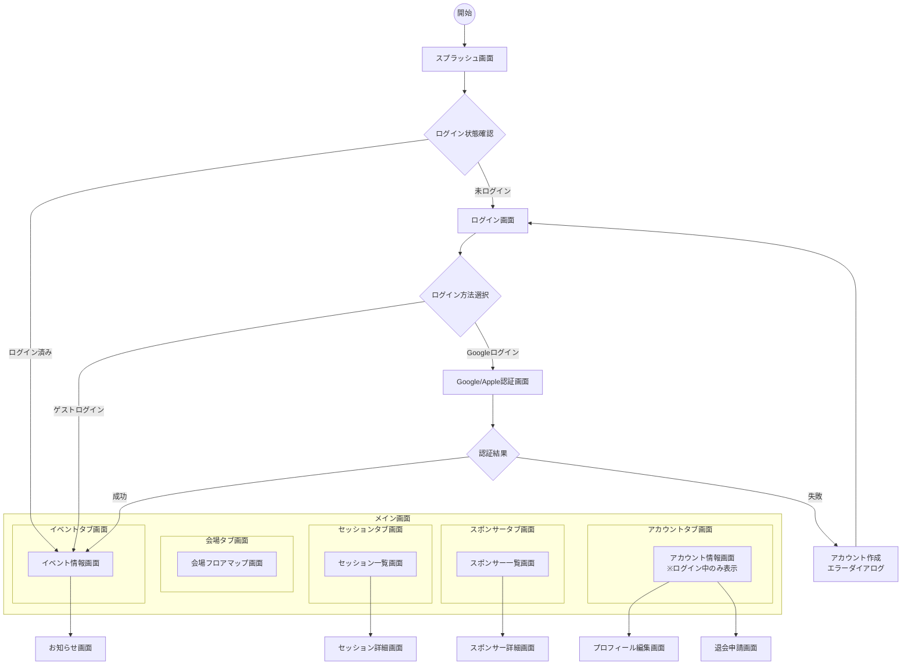

# FlutterKaigi 2025 アプリ 画面一覧

## 1. 概要

本ドキュメントは、FlutterKaigi 2025 のアプリにおける画面一覧・画面遷移図をまとめたものです。

画面ID・カテゴリ・日本語名・英語名・実装種別・遷移種別を整理し、ユーザーの種別ごとの画面遷移についても記載します。

## 2. 画面一覧

<!-- dprint-ignore-start -->
<!-- cspell:ignoreRegExp [A-Z]{1}-[A-Z]{4} -->
| ID | カテゴリ | 日本語名 | 英語名 | 実装種別 | 遷移種別 | 権限 |
|-|-|-|-|-|-|-|
| L-SPLH | 起動 | スプラッシュ画面 | SplashScreen | Flutter | Replace | 全員 |
| A-PLXM | 認証 | Google/Apple認証画面 | SocialAuthBottomSheet | InAppBrowser | BottomSheet | 要認証時 |
| A-KYSD | - | アカウント作成エラーダイアログ | AccountCreationErrorDialog | Flutter | Dialog | 要認証時 |
| D-HTFA | メイン | メイン画面 | MainScreen | Flutter | Replace | 全員（匿名可） |
| E-INFO | イベント | イベント情報画面 | EventInfoScreen | Flutter | - | 全員（匿名可） |
| E-GLMB | - | お知らせ画面 | NewsScreen | Flutter | Push | 全員（匿名可） |
| E-SESS | - | セッション一覧画面 | SessionListScreen | Flutter | - | 全員（匿名可） |
| E-SEDT | - | セッション詳細画面 | SessionDetailScreen | Flutter | Push | 全員（匿名可） |
| E-FMAP | - | 会場フロアマップ画面 | VenueFloorMapScreen | Flutter | - | 全員（匿名可） |
| S-LIST | スポンサー | スポンサー一覧画面 | SponsorListScreen | Flutter | - | 全員（匿名可） |
| S-DETA | - | スポンサー詳細画面 | SponsorDetailScreen | Flutter | Push | 全員（匿名可） |
| K-INFO | アカウント | アカウント情報画面 | AccountInfoScreen | Flutter | - | 全員（匿名可） |
| K-OVJL | - | プロフィール編集画面 | ProfileEditScreen | Flutter | Modal | 認証ユーザー |
| K-XRPU | - | 退会申請画面 | WithdrawalScreen | Flutter | Modal | 認証ユーザー |
<!-- dprint-ignore-end -->

> [!NOTE]
>
> - 実装種別
>   - Flutter
>   - InAppWebView
>   - InAppBrowser
> - 遷移種別
>   - Push
>   - Replace
>   - Modal
>   - BottomSheet
>   - Dialog
>   - Tab
>   - External

## 3. 画面遷移図

### 3-1. カンファレンス参加者向け（匿名ログイン含む）

