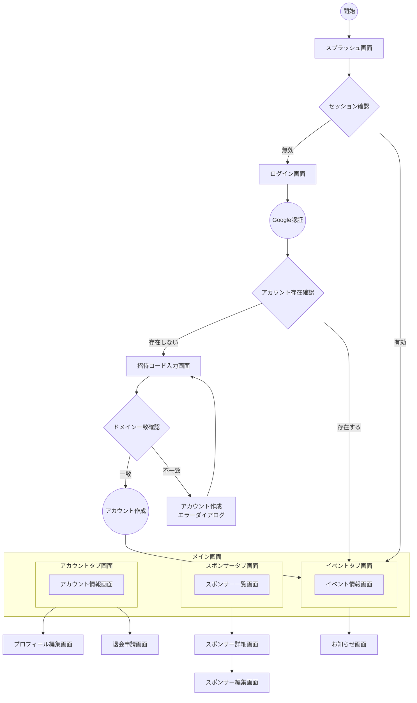

# FlutterKaigi 2025 Dashboard アプリ 画面一覧

## 1. 概要

本ドキュメントは、FlutterKaigi 2025 の Dashboard アプリにおける画面一覧・画面遷移図をまとめたものです。

画面ID・カテゴリ・日本語名・英語名・実装種別・遷移種別を整理し、ユーザーの種別ごとの画面遷移についても記載します。

## 2. 画面一覧

<!-- deno-fmt-ignore-start -->
<!-- cspell:ignoreRegExp [A-Z]{1}-[A-Z]{4} -->
| ID | カテゴリ | 日本語名 | 英語名 | 実装種別 | 遷移種別 |
|-|-|-|-|-|-|
| L-SPLH | 起動 | スプラッシュ画面 | SplashScreen | Flutter | Replace |
| A-QJTR | 認証 | ログイン画面 | LoginScreen | Flutter | Replace |
| A-PLXM | - | Google認証画面 | GoogleAuthBottomSheet | InAppBrowser | BottomSheet |
| A-URVN | - | 招待コード入力画面 | InvitationCodeScreen | Flutter | Push |
| A-KYSD | - | アカウント作成エラーダイアログ | AccountCreationErrorDialog | Flutter | Dialog |
| D-HTFA | メイン | メイン画面 | MainScreen | Flutter | Replace |
| E-NSQJ | イベント | イベントタブ画面 | EventTabScreen | Flutter | Tab |
| E-INFO | - | イベント情報画面 | EventInfoScreen | Flutter | - |
| E-GLMB | - | お知らせ画面 | NewsScreen | Flutter | Push |
| S-LKQZ | スポンサー | スポンサータブ画面 | SponsorTabScreen | Flutter | Tab |
| S-LIST | - | スポンサー一覧画面 | SponsorListScreen | Flutter | - |
| S-DETAIL | - | スポンサー詳細画面 | SponsorDetailScreen | Flutter | Push |
| S-YTRO | - | スポンサー編集画面 | SponsorEditScreen | Flutter | Modal |
| K-EMQY | アカウント | アカウントタブ画面 | AccountTabScreen | Flutter | Tab |
| K-INFO | - | アカウント情報画面 | AccountInfoScreen | Flutter | - |
| K-OVJL | - | プロフィール編集画面 | ProfileEditScreen | Flutter | Modal |
| K-XRPU | - | 退会申請画面 | WithdrawalScreen | Flutter | Modal |
<!-- deno-fmt-ignore-end -->

> [!NOTE]
>
> - 実装種別
>   - Flutter
>   - InAppWebView
>   - InAppBrowser
> - 遷移種別
>   - Push
>   - Replace
>   - Modal
>   - BottomSheet
>   - Dialog
>   - Tab
>   - External

## 3. 画面遷移図

### 3-1. スポンサー企業担当者向け

