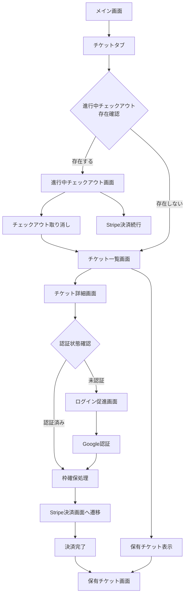

# チケット機能実装設計書

## 1. 概要

FlutterKaigi 2025 Dashboard アプリにチケット購入機能を実装する。

## 2. 実装方針

### 2.1 画面構成

- 新しいタブ「チケット」を4つ目のタブとして追加
- チケットタブ内で全ての機能を完結させる

### 2.2 認証要件

- **チケット種別一覧・詳細表示**: 匿名ユーザーでも閲覧可能
- **枠確保・購入**: Googleログイン必須
- 未ログイン状態での購入試行時は、ログインボタンを表示

### 2.3 優先表示ロジック

進行中のチェックアウトがある場合は、通常のチケット一覧を非表示にし、進行中チェックアウト情報を優先表示する。

## 3. 画面設計

### 3.1 画面一覧

| 画面ID | 画面名 | 説明 | 認証要件 |
|--------|--------|------|----------|
| T-LIST | チケット一覧画面 | 購入可能なチケット種別を表示 | 匿名可 |
| T-DETAIL | チケット詳細画面 | 特定チケット種別の詳細情報とオプション選択 | 匿名可 |
| T-CHECKOUT | 進行中チェックアウト画面 | 進行中の購入セッション情報 | 要認証 |
| T-OWNED | 保有チケット画面 | 購入済みチケット一覧 | 要認証 |

### 3.2 画面遷移図



## 4. 実装詳細

### 4.1 新規追加ファイル構成

```
apps/dashboard/lib/features/ticket/
├── data/
│   ├── ticket_repository.dart              # チケットデータ取得・操作
│   └── ticket_checkout_repository.dart     # チェックアウト操作
├── provider/
│   ├── ticket_list_provider.dart           # チケット一覧状態管理
│   ├── ticket_detail_provider.dart         # チケット詳細状態管理
│   ├── active_checkout_provider.dart       # 進行中チェックアウト状態管理
│   └── owned_tickets_provider.dart         # 保有チケット状態管理
└── ui/
    ├── ticket_list_screen.dart             # チケット一覧画面
    ├── ticket_detail_screen.dart           # チケット詳細画面
    ├── active_checkout_screen.dart         # 進行中チェックアウト画面
    ├── owned_tickets_screen.dart           # 保有チケット画面
    └── components/
        ├── ticket_card.dart                # チケット種別カード
        ├── ticket_option_selector.dart     # オプション選択UI
        ├── checkout_summary.dart           # チェックアウト要約
        └── login_prompt_widget.dart        # ログイン促進UI
```

### 4.2 メイン画面への統合

#### 4.2.1 タブ追加

`apps/dashboard/lib/core/ui/main/main_screen.dart` の `destinations` にチケットタブを追加：

```dart
ResponsiveScaffoldDestination(icon: Icons.confirmation_number, title: 'チケット'),
```

#### 4.2.2 ルーティング設定

`apps/dashboard/lib/core/router/router.dart` にチケット関連ルートを追加。

### 4.3 状態管理設計

#### 4.3.1 チケット一覧 Provider

- API: `getTicketTypes()`
- 状態: `List<TicketTypeWithOptionsItem>`
- エラーハンドリング、ローディング状態を含む

#### 4.3.2 進行中チェックアウト Provider

- API: `getUserTickets()` の `ticketCheckouts` 部分
- 優先表示ロジック: 進行中チェックアウトが存在する場合は他画面を非表示
- 取り消し機能（将来のAPI実装予定）

#### 4.3.3 枠確保 Provider

- API: `createCheckout()`
- Stripe URL への遷移処理
- 認証状態チェック

### 4.4 画面仕様詳細

#### 4.4.1 チケット一覧画面 (T-LIST)

**表示内容:**

- 各チケット種別のカード表示
- チケット名、価格、販売状況、概要
- 進行中チェックアウトがある場合は非表示

**操作:**

- チケットカードタップ → 詳細画面へ遷移
- 保有チケット表示ボタン（認証済みユーザーのみ）

#### 4.4.2 チケット詳細画面 (T-DETAIL)

**表示内容:**

- チケット種別の詳細情報
- 利用可能オプション一覧
- 価格計算（オプション込み）
- 販売期間、在庫状況

**操作:**

- オプション選択
- 購入ボタン
  - 未認証: ログインボタン表示
  - 認証済み: 枠確保実行

#### 4.4.3 進行中チェックアウト画面 (T-CHECKOUT)

**表示内容:**

- 枠確保中のチケット情報
- 有効期限（countdown表示）
- 選択したオプション
- 合計金額

**操作:**

- 「決済を続行」ボタン → Stripe画面へ
- 「取り消し」ボタン → チェックアウト取り消し（API未実装）

#### 4.4.4 保有チケット画面 (T-OWNED)

**表示内容:**

- 購入済みチケット一覧
- 各チケットの詳細情報
- 購入日時

**操作:**

- チケット詳細表示

### 4.5 API統合

#### 4.5.1 使用するbff_client API

```dart
// チケット種別一覧取得
Future<TicketTypesWithOptionsResponse> getTicketTypes();

// チケット種別詳細取得
Future<TicketTypeWithOptionsResponse> getTicketTypeWithOptions(String ticketTypeId);

// ユーザーのチケット情報取得（購入済み + 進行中）
Future<UserTicketsResponse> getUserTickets();

// 枠確保（チェックアウト開始）
Future<TicketCheckoutResponse> createCheckout(TicketCheckoutRequest request);

// チェックアウトセッション詳細取得
Future<TicketCheckoutSessionResponse> getCheckoutSession(String sessionId);
```

#### 4.5.2 今後実装予定API

- チェックアウト取り消し API（`DELETE /v1/tickets/checkout/{sessionId}`等）

### 4.6 エラーハンドリング

#### 4.6.1 共通エラー

- ネットワークエラー
- 認証エラー
- サーバーエラー

#### 4.6.2 チケット固有エラー

- 在庫切れ
- 販売期間外
- チェックアウト期限切れ

### 4.7 パフォーマンス考慮事項

[[memory:3127631]] のメモリー指針に従い：

- DBリクエストを1回で済ませてN+1問題を回避
- JOINとjson_aggを活用したパフォーマンス最適化
- type castを避けた実装
- db_typesの型を活用した一発parse

## 5. 実装順序

1. **フェーズ1: 基盤実装**
   - タブ追加とルーティング設定
   - Repository層の実装
   - 基本的なProvider実装

2. **フェーズ2: 表示機能**
   - チケット一覧画面
   - チケット詳細画面
   - 基本的なUI Components

3. **フェーズ3: 購入フロー**
   - 認証チェック機能
   - 枠確保処理
   - Stripe連携

4. **フェーズ4: 進行中チェックアウト**
   - 進行中チェックアウト画面
   - 優先表示ロジック
   - 取り消し機能UI（API実装待ち）

5. **フェーズ5: 保有チケット表示**
   - 保有チケット画面
   - 統合テスト

## 6. 注意事項

- [[memory:3127601]] に従い、Map<String, dynamic>を避けて明示的な型定義を使用
- チケット購入は金銭が関わるため、エラーハンドリングを特に丁寧に実装
- 進行中チェックアウトの期限管理に注意
- Stripe決済画面からの戻り処理を適切に実装
